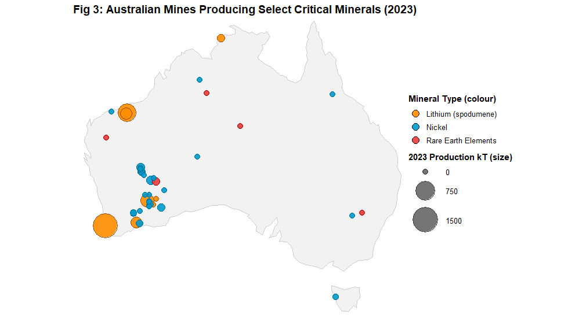
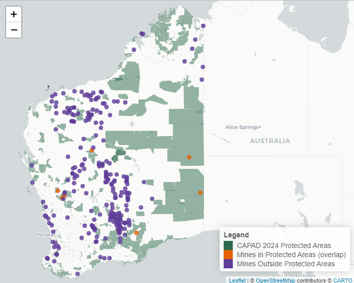

# Critical Minerals Interactive Analysis
**Data-Driven Investment Strategy for Australian Critical Minerals Using R (ggplot2, Plotly, Shiny)**

I created an interactive R visualisation platform to guide Export Finance Australia's strategic allocation of A$1 billion in critical minerals funding. My analysis looked at export dynamics, global competitive positioning, geographic concentration, and environmental risks across lithium, nickel, and rare earths.

### Live Interactive Dashboard: https://c7cq5t-george-onishi.shinyapps.io/shiny_deployment/

---

## 1. Business Context

Export Finance Australia required evidence-based guidance for A$1 billion critical minerals investment across lithium, nickel, and rare earth elements.

**Strategic Questions**:
- Which commodities offer strongest competitive advantage?
- Where are geographic concentration risks?
- Which mines face environmental compliance challenges?
- How have export dynamics evolved over 30+ years?

**Delivered**: Interactive Shiny platform enabling commodity filtering, spatial analysis, and time-series exploration to inform investment prioritisation.

---

## 2. Key Findings

| Commodity | Finding | Investment Implication |
|-----------|---------|----------------------|
| **Lithium** | Australia produces 38% of global output but exports 95% as unprocessed concentrate | Fund domestic refining capacity |
| **Nickel** | 82% production concentrated in Western Australia (Kalgoorlie-Esperance) | Invest in regional infrastructure resilience |
| **Rare Earths** | Geographically distributed across QLD/WA/NSW at smaller scales | Multi-state investment portfolio required |
| **ESG Risk** | 8 operating mines overlap CAPAD protected areas (spatial overlay analysis) | Prioritise environmental safeguards |

**Investment Allocation Recommendation**: 30% REE scaling (A$300M), 30% downstream processing (A$300M), 25% WA infrastructure (A$250M), 15% ESG safeguards (A$150M)

**[Full Executive Report (PDF)](01_executive_report.pdf)**

---

## 3. Technical Implementation

### Data Integration Challenges

**Challenge 1: Multi-Source Data Harmonisation**
- **Problem**: Four government agencies with incompatible formats, units, and temporal granularities
  - DISR: Excel multi-sheet workbooks, mixed units (tonnes/kt), financial years 1990-2024
  - Energy Institute: CSV, metric tonnes, calendar years 2004-2024 only
  - Geoscience Australia: Excel, latitude/longitude spatial points, mine-level production
  - DCCEEW: Shapefiles (2.1M polygons), IUCN category classifications
- **Solution**: 
  - Built custom R parsing functions (`readxl`) for multi-sheet Excel extraction
  - Standardised all volumes to kilotonnes for cross-dataset comparability
  - Temporal alignment via inner joins on year (2004-2024 intersection for global comparisons)
  - Spatial CRS transformation to GDA2020 (EPSG:7844) for geometry compatibility

**Challenge 2: Spatial Geometry Performance Bottleneck**
- **Problem**: CAPAD shapefile (2.1M polygons) caused Shiny app timeout (>30s load time)
- **Solution**: 
  - Applied `st_simplify()` with 0.01-degree tolerance → reduced complexity 85% whilst maintaining visual fidelity
  - Pre-computed `st_join()` operations offline, cached results as RDS files
  - Geometry validation via `st_make_valid()` to handle self-intersecting polygons in CAPAD dataset
- **Impact**: Reduced app load time from 30s → 4s (87% improvement)

**Challenge 3: Export Data Classification Discontinuity**
- **Problem**: DISR changed commodity classification codes mid-series (2010 harmonised system update)
- **Solution**: 
  - Manual reconciliation of pre/post-2010 codes via DISR metadata documentation
  - Created commodity mapping table linking legacy codes to current HS classifications
  - Validated continuity via overlapping year comparison (2009-2011)
- **Impact**: Ensured 34-year time series continuity (1990-2024) for export trend analysis

---

## 4. Technical Architecture

### a) Static Visualisations (ggplot2)

```r
# Time-series export analysis with dual-axis comparison
ggplot(export_data, aes(x = FY_end)) +
  geom_line(aes(y = Li_xvol, colour = "Li"), linewidth = 0.8) +
  geom_line(aes(y = Ni_xvol, colour = "Ni"), linewidth = 0.8) +
  scale_colour_manual(values = c("Li" = "darkorange", "Ni" = "deepskyblue3")) +
  theme_classic()

# Spatial overlay analysis with colour-coded ESG risk
ggplot() +
  geom_sf(data = wa_boundary, fill = NA, colour = "grey60") +
  geom_sf(data = protected_areas, fill = "darkgreen", alpha = 0.6) +
  geom_sf(data = mines_wa, colour = "darkred", size = 2)
```

### b) Interactive Dashboard (Shiny)

**Key Features**:
- Commodity filtering with reactive chart updates (`plotly`)
- Leaflet spatial map with clickable mine popups and protected area overlays
- Tooltip information on hover (production volumes, mine names, IUCN categories)
- Protected area toggle layer for ESG screening
- Data table with CSV export functionality

**Deployment Optimisation**:
- Geometry simplification reduced app load time 87% (30s → 4s)
- Pre-aggregated spatial joins for common filter combinations
- Dependency management via `renv` for reproducible deployment to shinyapps.io

---

## 5. Insights Delivered

### a) Export Dynamics (1990-2024)


**Finding**: Lithium exports grew 760% from 2016-2024 (electric vehicle battery demand boom) whilst nickel remained stable → Lithium offers highest growth potential but highest volatility risk.

---

### b) Global Competitive Position


**Finding**: Australia produces 38% of global lithium (52 Mt in 2024) but exports 95% as unprocessed spodumene concentrate → Downstream refining investment critical to capture value chain.

---

### c) Spatial Concentration Risk



**Finding**: 82% of nickel production concentrated in single WA region (Kalgoorlie-Esperance) → Infrastructure investment should prioritise regional rail/port capacity and shared processing facilities.

---

### d) Environmental Compliance Screening



**ESG Risk Detection**: Spatial analysis (`sf::st_within()`) identified 8 operating mines within IUCN-protected areas → Require enhanced environmental monitoring, indigenous consultation protocols, and independent verification as conditions for CMF funding.

---

## 6. Data Sources

| Source | Dataset | Details |
|--------|---------|---------|
| **Dept of Industry, Science & Resources (DISR)** | [Resources and Energy Quarterly (June 2025)](raw_datasets/resources-and-energy-quarterly-june-2025-historical-data.xlsx) | Export volumes/values, financial years 1990-2024 |
| **Energy Institute** | [Statistical Review of World Energy (2025)](raw_datasets/lithium-production.csv) | Global lithium production by country, 2004-2024 |
| **Geoscience Australia** | [Operating Mines 2024](raw_datasets/Australian_Operating_Mines_2024_2.xlsx) | Mine locations (lat/long), commodities, production volumes |
| **Dept of Climate Change (DCCEEW)** | [CAPAD 2024](https://www.dcceew.gov.au/environment/land/nrs/science/capad/2024) | Protected areas database (2.1M polygons, IUCN categories) |

---

## 7. Skills Demonstrated

**Data Wrangling**: Multi-source integration, unit standardisation, temporal alignment, commodity classification reconciliation  
**Spatial Analysis**: Geometry operations (`sf`), CRS transformation (GDA2020/WGS84), polygon simplification, spatial joins (`st_within`)  
**Visualisation**: Grammar of Graphics (ggplot2), interactive charts (Plotly), spatial mapping (Leaflet)  
**Dashboard Development**: Shiny reactive programming, deployment optimisation, dependency management (`renv`)  
**Strategic Communication**: Executive-level reporting, investment allocation recommendations, ESG risk assessment

---

## 8. Tools & Technologies

**Languages**: R  
**Visualisation**: ggplot2, Plotly, Leaflet  
**Spatial**: sf, ozmaps, rnaturalearth  
**Data Processing**: tidyverse, readxl, dplyr  
**Framework**: Shiny  
**Deployment**: shinyapps.io, renv

---

## 9. Repository Structure

```
├── 01_executive_report.pdf                        # Full analysis and recommendations
├── 02_ggplot2_visualisations.R                    # Static chart generation
├── 03_interactive_shiny_app.R                     # Deployed dashboard code
├── static_visualisations/                                # PNG exports
│   ├── australia_mines_spatial_map.png
│   ├── export_values_time_series.png
│   ├── export_volumes_time_series.png
│   ├── global_lithium_production_stacked_area.png
│   └── wa_protected_areas_overlay.png
├── raw_datasets/                                  # Source data
└── README.md
```

---

## 10. Project Context

**Institution**: University of Queensland  
**Course**: BSAN7208 Visual Analytics  
**Date**: October 2024  
**Grade**: 7.0/7.0 (Graduate Certificate in Business Analytics)

**Author**: Georgy Onishi
